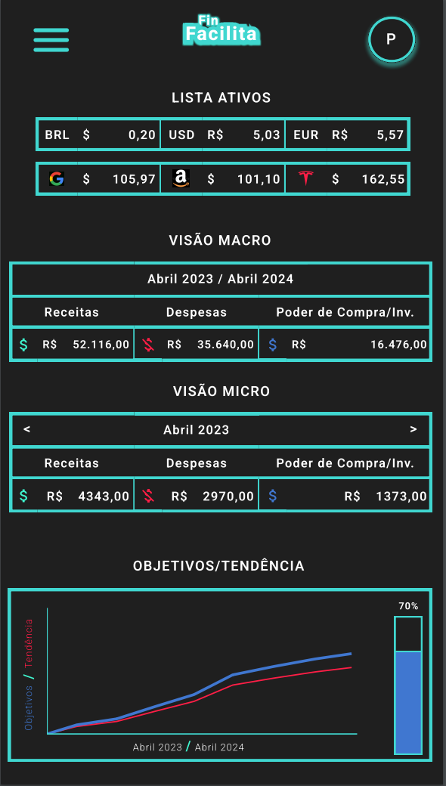

<h1 align="center">
	Projeto-FIAP-Fintech-99583
</h1>

	

<h2 align="center">
	DOCUMENTO VISÃO FINTECH
</h2>

O aplicativo FinFacilita foi feito 1.PARA pessoas que precisam organizar dívidas e gastos para sair ou fugir do 
vermelho, e 1.PARA pessoas que valorizam o planejamento financeiro para atingir seus objetivos com a maior eficiência.

Clientes 2.QUE ESTÃO INSATISFEITOS COM a falta de objetividade dos aplicativos atuais de planejamento 
financeiro como Mobills, Organizze e GuiaBolso devem migrar imediatamente para o 3.NOSSO PRODUTO FinFacilita que prioriza
a objetividade e o diferencial na hora da visualização das finanças, para clientes que necessitam de um aplicativo 4.QUE
FORNECE gráficos com objetivos pré definidos, logo na página principal, exibindo com rapidez e clareza quanto de Poder de
Compra/Investimento o cliente tem em cada mês, que é o fator decisivo para o controle de dívidas e investimentos conforme
suas necessidades. 4.AO CONTRÁRIO DE todos os outros aplicativos que só repetem o que o NuBank faz, que é mostrar as 
finanças de forma comum e somente separando as fontes de gastos, os agrupando de várias formas visuais que não agregam em
nada mais além do básico.

5.NOSSO PRODUTO não é comum, é tecnológico e representa uma evolução comparado aos serviços atuais, pois o que 
oferecemos é a visualização do fator decisivo para controle tanto de dívidas, quanto de investimentos, como fonte principal
da geração de gráficos e  tabelas. Fator esse que chamamos de Poder de Compra/Investimento, que é calculado através da 
subtração entre os gastos e ganhos do cliente. Exibindo inclusive gastos dos meses futuros para uma visualização melhor de
contas futuras e financiamentos de cartões de crédito, tudo numa só página principal, para que o cliente não se perca e 
possa ter uma visão macro sobre suas finanças, sem ter a necessidade de entrar em muitos filtros e/ou configurações para
acessar esses dados. 5.NOSSO PRODUTO e também nosso outro diferencial é que oferecemos o cálculo automático e atual de
empréstimos, parcelamentos e investimentos, através de inteligência artificial para auxiliar qual a melhor forma de sair do
vermelho, ou conquistar seus objetivos, comparando-os. Isso é possível através de cálculos de fatores simples, como exemplo
no tema dívidas, o cálculo de fatores como: valores de taxas e juros, de empréstimos ou parcelamentos a fim de mostrar a
melhor forma e mais rápida de sair do vermelho, seja pagando últimas parcelas, ou selecionando a menor taxa de juros,
exibindo o poder de compra/investimento futuro atrelado aos cálculos; já no tema investimentos, o cálculo de fatores como
tempo para conquistar tal objetivo, custo benefício do objetivo conforme rendimentos, indicadores de risco baseados em 
dados e estatísticas, tudo isso acompanhado de indicadores gerais como o de tempo faltando para conquista dos objetivos,
visualizadores de porcentagem da conclusão dos mesmos, e gráficos indicando a curva de progresso e tendência do cliente
a conquistar seus objetivos, a fim de obter o controle de tudo em seu mundo de finanças e conseguir conquistar a 
qualidade de vida tão necessária, estimada e apreciada por todos.

 

 

[Fintech_RM99583.pdf](https://github.com/rodrigopazian/Projeto-FIAP-Fintech-99583/files/11995280/Fintech_RM99583.pdf)
